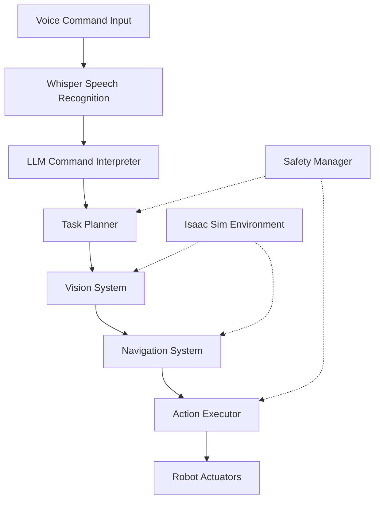

# Capstone Project Implementation Guide

## Overview

This implementation guide provides step-by-step instructions for completing the autonomous humanoid robot capstone project. Follow this guide to systematically build and integrate all components into a complete, functioning system.

## Phase 1: System Design and Architecture (Days 1-7)

### Day 1-2: System Architecture Design

#### 1. Define System Architecture


#### 2. Create Package Structure
```bash
# Create workspace
mkdir -p ~/capstone_ws/src
cd ~/capstone_ws/src

# Create main packages
git clone https://github.com/your-organization/capstone_bringup.git
git clone https://github.com/your-organization/capstone_perception.git
git clone https://github.com/your-organization/capstone_navigation.git
git clone https://github.com/your-organization/capstone_vla.git
git clone https://github.com/your-organization/capstone_control.git
```

#### 3. Design Component Interfaces
```yaml
# capstone_interfaces/CMakeLists.txt
cmake_minimum_required(VERSION 3.8)
project(capstone_interfaces)

find_package(ament_cmake REQUIRED)
find_package(rosidl_default_generators REQUIRED)
find_package(std_msgs REQUIRED)
find_package(geometry_msgs REQUIRED)
find_package(nav_msgs REQUIRED)

# Define custom messages
set(msg_files
  "msg/VoiceCommand.msg"
  "msg/RobotState.msg"
  "msg/TaskPlan.msg"
)

set(srv_files
  "srv/ExecuteTask.srv"
  "srv/GetEnvironment.srv"
)

rosidl_generate_interfaces(${PROJECT_NAME}
  ${msg_files}
  ${srv_files}
  DEPENDENCIES std_msgs geometry_msgs nav_msgs
)

ament_export_dependencies(rosidl_default_runtime)
```

### Day 3-4: Core Infrastructure Setup

#### 1. Implement Voice Command System
```python
# capstone_vla/capstone_vla/voice_command_node.py
import rclpy
from rclpy.node import Node
from capstone_interfaces.msg import VoiceCommand
from std_msgs.msg import String
import openai
import whisper
import pyaudio
import wave
import threading

class VoiceCommandNode(Node):
    def __init__(self):
        super().__init__('voice_command_node')

        # Publishers and subscribers
        self.voice_cmd_publisher = self.create_publisher(VoiceCommand, 'voice_commands', 10)
        self.status_publisher = self.create_publisher(String, 'system_status', 10)

        # Audio parameters
        self.chunk = 1024
        self.format = pyaudio.paInt16
        self.channels = 1
        self.rate = 16000
        self.record_seconds = 5

        # Whisper model
        self.whisper_model = whisper.load_model("base")

        # Wake word detection
        self.wake_word = "robot"

        # Start listening thread
        self.listening_thread = threading.Thread(target=self.listen_continuously)
        self.listening_thread.daemon = True
        self.listening_thread.start()

        self.get_logger().info("Voice Command Node initialized")

    def listen_continuously(self):
        """Continuously listen for voice commands"""
        p = pyaudio.PyAudio()

        while True:
            # Record audio
            stream = p.open(format=self.format,
                           channels=self.channels,
                           rate=self.rate,
                           input=True,
                           frames_per_buffer=self.chunk)

            self.get_logger().info("Listening for wake word...")
            frames = []

            # Listen for wake word
            for i in range(0, int(self.rate / self.chunk * self.record_seconds)):
                data = stream.read(self.chunk)
                frames.append(data)

                # Simple wake word detection (in practice, use more sophisticated methods)
                if self.contains_wake_word(frames[-10:]):  # Check last 10 frames
                    self.get_logger().info("Wake word detected!")

                    # Record full command
                    command_frames = []
                    for j in range(0, int(self.rate / self.chunk * 3)):  # Record 3 more seconds
                        data = stream.read(self.chunk)
                        command_frames.append(data)

                    # Process command
                    command_text = self.transcribe_audio(command_frames)
                    if command_text.strip():
                        self.publish_voice_command(command_text)
                    break

            stream.stop_stream()
            stream.close()

    def contains_wake_word(self, audio_frames):
        """Simple wake word detection"""
        # In practice, use proper speech recognition
        # This is a simplified placeholder
        return True  # Placeholder - implement proper detection

    def transcribe_audio(self, frames):
        """Transcribe audio frames to text using Whisper"""
        try:
            # Save frames to temporary WAV file
            with wave.open('/tmp/temp_command.wav', 'wb') as wf:
                wf.setnchannels(self.channels)
                wf.setsampwidth(pyaudio.PyAudio().get_sample_size(self.format))
                wf.setframerate(self.rate)
                wf.writeframes(b''.join(frames))

            # Transcribe using Whisper
            result = self.whisper_model.transcribe("/tmp/temp_command.wav")
            return result["text"].strip()
        except Exception as e:
            self.get_logger().error(f"Transcription error: {e}")
            return ""

    def publish_voice_command(self, command_text):
        """Publish voice command to the system"""
        msg = VoiceCommand()
        msg.command = command_text
        msg.timestamp = self.get_clock().now().to_msg()
        msg.confidence = 0.8  # Placeholder confidence

        self.voice_cmd_publisher.publish(msg)
        self.get_logger().info(f"Published command: {command_text}")

def main(args=None):
    rclpy.init(args=args)
    node = VoiceCommandNode()

    try:
        rclpy.spin(node)
    except KeyboardInterrupt:
        node.get_logger().info("Shutting down voice command node")
    finally:
        node.destroy_node()
        rclpy.shutdown()

if __name__ == '__main__':
    main()
```

#### 2. Create Launch File
```xml
<!-- capstone_bringup/launch/capstone_system.launch.py -->
from launch import LaunchDescription
from launch_ros.actions import Node
from launch.actions import DeclareLaunchArgument
from launch.substitutions import LaunchConfiguration
from ament_index_python.packages import get_package_share_directory
import os

def generate_launch_description():
    # Declare launch arguments
    use_sim_time = LaunchConfiguration('use_sim_time', default='true')

    # Voice command node
    voice_command_node = Node(
        package='capstone_vla',
        executable='voice_command_node',
        name='voice_command_node',
        parameters=[
            {'use_sim_time': use_sim_time}
        ],
        output='screen'
    )

    # Task planner node
    task_planner_node = Node(
        package='capstone_vla',
        executable='task_planner_node',
        name='task_planner_node',
        parameters=[
            {'use_sim_time': use_sim_time}
        ],
        output='screen'
    )

    # Perception node
    perception_node = Node(
        package='capstone_perception',
        executable='perception_node',
        name='perception_node',
        parameters=[
            {'use_sim_time': use_sim_time}
        ],
        output='screen'
    )

    # Navigation node
    navigation_node = Node(
        package='capstone_navigation',
        executable='navigation_node',
        name='navigation_node',
        parameters=[
            {'use_sim_time': use_sim_time}
        ],
        output='screen'
    )

    # Control node
    control_node = Node(
        package='capstone_control',
        executable='control_node',
        name='control_node',
        parameters=[
            {'use_sim_time': use_sim_time}
        ],
        output='screen'
    )

    return LaunchDescription([
        voice_command_node,
        task_planner_node,
        perception_node,
        navigation_node,
        control_node
    ])
```

### Day 5-7: Isaac Sim Environment Setup

#### 1. Create Isaac Sim Scene
```python
# capstone_isaac_env/isaac_env_setup.py
import omni
from omni.isaac.core import World
from omni.isaac.core.utils.stage import add_reference_to_stage
from omni.isaac.core.utils.nucleus import get_assets_root_path
from omni.isaac.core.utils.prims import create_prim
from omni.isaac.core.utils.viewports import set_camera_view
import carb

class CapstoneEnvironment:
    def __init__(self):
        self.world = World(stage_units_in_meters=1.0)
        self.assets_root_path = get_assets_root_path()

    def setup_environment(self):
        """Set up the complete environment"""
        # Add ground plane
        self.world.scene.add_default_ground_plane()

        # Add robot (Franka Panda for demonstration)
        if self.assets_root_path:
            robot_path = self.assets_root_path + "/Isaac/Robots/Franka/franka_alt_fpv.usd"
            add_reference_to_stage(usd_path=robot_path, prim_path="/World/Robot")

        # Add furniture and objects
        self.add_environment_objects()

        # Set up lighting
        self.setup_lighting()

        # Configure camera view
        set_camera_view(eye=[5, 5, 5], target=[0, 0, 0])

    def add_environment_objects(self):
        """Add objects to create a realistic environment"""
        # Add table
        create_prim(
            prim_path="/World/Table",
            prim_type="Cube",
            position=[2.0, 0.0, 0.5],
            scale=[2.0, 1.0, 1.0],
            orientation=[0, 0, 0, 1]
        )

        # Add objects on table
        create_prim(
            prim_path="/World/Object1",
            prim_type="Cylinder",
            position=[2.0, 0.0, 1.0],
            scale=[0.1, 0.1, 0.2],
            orientation=[0, 0, 0, 1]
        )

        # Add obstacles
        create_prim(
            prim_path="/World/Obstacle1",
            prim_type="Cube",
            position=[1.0, 1.0, 0.5],
            scale=[0.5, 0.5, 1.0],
            orientation=[0, 0, 0, 1]
        )

    def setup_lighting(self):
        """Set up realistic lighting"""
        # Add dome light for environment lighting
        create_prim(
            prim_path="/World/DomeLight",
            prim_type="DomeLight",
            attributes={"color": [0.2, 0.2, 0.2], "intensity": 3000}
        )

        # Add directional light for shadows
        create_prim(
            prim_path="/World/DirectionalLight",
            prim_type="DistantLight",
            attributes={"color": [0.8, 0.8, 0.8], "intensity": 600}
        )

def main():
    env = CapstoneEnvironment()
    env.setup_environment()

    # Reset world to apply changes
    env.world.reset()

    print("Capstone environment setup complete!")

if __name__ == "__main__":
    main()
```

## Phase 2: Component Implementation (Days 8-21)

### Day 8-10: VLA System Implementation

#### 1. Task Planner Node
```python
# capstone_vla/capstone_vla/task_planner_node.py
import rclpy
from rclpy.node import Node
from capstone_interfaces.msg import VoiceCommand, TaskPlan
from capstone_interfaces.srv import ExecuteTask
from geometry_msgs.msg import Pose
from std_msgs.msg import String
import openai
import json

class TaskPlannerNode(Node):
    def __init__(self):
        super().__init__('task_planner_node')

        # Initialize OpenAI client
        self.client = openai.OpenAI(api_key=self.get_parameter_or('openai_api_key', ''))

        # Subscriptions
        self.voice_cmd_sub = self.create_subscription(
            VoiceCommand,
            'voice_commands',
            self.voice_command_callback,
            10
        )

        # Publishers
        self.task_plan_pub = self.create_publisher(TaskPlan, 'task_plans', 10)
        self.status_pub = self.create_publisher(String, 'system_status', 10)

        # Services
        self.execute_task_srv = self.create_service(
            ExecuteTask,
            'execute_task',
            self.execute_task_callback
        )

        self.get_logger().info("Task Planner Node initialized")

    def voice_command_callback(self, msg):
        """Process voice command and generate task plan"""
        command = msg.command
        self.get_logger().info(f"Processing command: {command}")

        try:
            # Generate task plan using LLM
            task_plan = self.generate_task_plan(command)

            if task_plan:
                # Publish task plan
                self.task_plan_pub.publish(task_plan)

                # Publish status update
                status_msg = String()
                status_msg.data = f"Task plan generated for: {command}"
                self.status_pub.publish(status_msg)

                self.get_logger().info(f"Task plan published for command: {command}")
            else:
                self.get_logger().error(f"Failed to generate task plan for: {command}")

        except Exception as e:
            self.get_logger().error(f"Error processing command '{command}': {e}")

    def generate_task_plan(self, command):
        """Generate task plan using LLM"""
        try:
            prompt = f"""
            Given the following command: "{command}"

            Generate a detailed task plan as a sequence of specific robot actions.

            Available robot capabilities:
            - Navigation: move_to(location), go_to(location)
            - Manipulation: pick_up(object), place_object(object, location), grasp(object)
            - Perception: detect_object(object_type), locate_object(object_type)
            - Interaction: speak(text), listen()

            Return your response as valid JSON with the following structure:
            {{
                "command": "{command}",
                "actions": [
                    {{
                        "action_type": "navigation|manipulation|perception|interaction",
                        "action_name": "specific_action_name",
                        "parameters": {{"param_name": "param_value"}},
                        "description": "brief description of the action"
                    }}
                ],
                "estimated_completion_time": "time_estimate_in_seconds",
                "confidence": 0.0-1.0
            }}

            Be specific and ensure actions are executable by a robot.
            """

            response = self.client.chat.completions.create(
                model="gpt-4",
                messages=[
                    {"role": "system", "content": "You are a task planner for a robotics system. Generate detailed, executable task plans from natural language commands."},
                    {"role": "user", "content": prompt}
                ],
                temperature=0.1,
                response_format={"type": "json_object"}
            )

            plan_data = json.loads(response.choices[0].message.content)

            # Create TaskPlan message
            task_plan_msg = TaskPlan()
            task_plan_msg.command = command
            task_plan_msg.estimated_time = float(plan_data.get('estimated_completion_time', 60.0))
            task_plan_msg.confidence = float(plan_data.get('confidence', 0.8))

            # Convert actions to message format
            for action_data in plan_data['actions']:
                action_msg = ActionStep()  # Assuming you have this message type
                action_msg.action_type = action_data['action_type']
                action_msg.action_name = action_data['action_name']
                action_msg.description = action_data['description']

                # Convert parameters to key-value pairs
                for key, value in action_data['parameters'].items():
                    param_msg = Parameter()
                    param_msg.name = key
                    param_msg.value = str(value)
                    action_msg.parameters.append(param_msg)

                task_plan_msg.actions.append(action_msg)

            return task_plan_msg

        except Exception as e:
            self.get_logger().error(f"Error generating task plan: {e}")
            return None

    def execute_task_callback(self, request, response):
        """Execute a specific task"""
        try:
            # This would integrate with the action execution system
            self.get_logger().info(f"Executing task: {request.task_description}")

            # In a real implementation, this would call the action execution system
            # For now, we'll simulate execution
            response.success = True
            response.message = f"Task '{request.task_description}' executed successfully"

        except Exception as e:
            response.success = False
            response.message = f"Task execution failed: {e}"
            self.get_logger().error(f"Task execution error: {e}")

        return response

def main(args=None):
    rclpy.init(args=args)
    node = TaskPlannerNode()

    try:
        rclpy.spin(node)
    except KeyboardInterrupt:
        node.get_logger().info("Shutting down task planner node")
    finally:
        node.destroy_node()
        rclpy.shutdown()

if __name__ == '__main__':
    main()
```

#### 2. Perception Node Implementation
```python
# capstone_perception/capstone_perception/perception_node.py
import rclpy
from rclpy.node import Node
from sensor_msgs.msg import Image, PointCloud2
from geometry_msgs.msg import Point
from capstone_interfaces.msg import EnvironmentState
from std_msgs.msg import Header
import cv2
import numpy as np
from cv_bridge import CvBridge
import open3d as o3d

class PerceptionNode(Node):
    def __init__(self):
        super().__init__('perception_node')

        self.bridge = CvBridge()

        # Subscriptions
        self.rgb_sub = self.create_subscription(
            Image,
            '/camera/rgb/image_raw',
            self.rgb_callback,
            10
        )

        self.depth_sub = self.create_subscription(
            Image,
            '/camera/depth/image_raw',
            self.depth_callback,
            10
        )

        # Publishers
        self.environment_pub = self.create_publisher(EnvironmentState, 'environment_state', 10)
        self.pointcloud_pub = self.create_publisher(PointCloud2, 'pointcloud', 10)

        # Timer for periodic environment updates
        self.timer = self.create_timer(1.0, self.update_environment)

        # Internal state
        self.current_rgb = None
        self.current_depth = None
        self.object_detections = []

        self.get_logger().info("Perception Node initialized")

    def rgb_callback(self, msg):
        """Process RGB image data"""
        try:
            # Convert ROS image to OpenCV
            cv_image = self.bridge.imgmsg_to_cv2(msg, "bgr8")

            # Store current image
            self.current_rgb = cv_image

            # Run object detection
            detections = self.detect_objects(cv_image)
            self.object_detections = detections

            self.get_logger().debug(f"Detected {len(detections)} objects")

        except Exception as e:
            self.get_logger().error(f"Error processing RGB image: {e}")

    def depth_callback(self, msg):
        """Process depth image data"""
        try:
            # Convert ROS image to OpenCV
            depth_image = self.bridge.imgmsg_to_cv2(msg, "32FC1")

            # Store current depth
            self.current_depth = depth_image

            self.get_logger().debug("Processed depth image")

        except Exception as e:
            self.get_logger().error(f"Error processing depth image: {e}")

    def detect_objects(self, image):
        """Detect objects in the image"""
        # This would normally use a trained object detection model
        # For this example, we'll simulate detection
        height, width = image.shape[:2]

        # Simulate some detections (in practice, use YOLO, SSD, or similar)
        detections = []

        # Simple color-based detection for demonstration
        hsv = cv2.cvtColor(image, cv2.COLOR_BGR2HSV)

        # Define color ranges for different objects
        colors = {
            'red': ([0, 100, 100], [10, 255, 255]),
            'blue': ([100, 100, 100], [130, 255, 255]),
            'green': ([40, 100, 100], [80, 255, 255])
        }

        for color_name, (lower, upper) in colors.items():
            mask = cv2.inRange(hsv, np.array(lower), np.array(upper))
            contours, _ = cv2.findContours(mask, cv2.RETR_EXTERNAL, cv2.CHAIN_APPROX_SIMPLE)

            for contour in contours:
                area = cv2.contourArea(contour)
                if area > 500:  # Filter small contours
                    x, y, w, h = cv2.boundingRect(contour)

                    # Calculate center and approximate distance from depth
                    center_x, center_y = x + w//2, y + h//2
                    distance = self.get_distance_at_pixel(center_x, center_y)

                    detection = {
                        'class': color_name,
                        'confidence': 0.8,
                        'bbox': [x, y, x+w, y+h],
                        'center': [center_x, center_y],
                        'distance': distance
                    }
                    detections.append(detection)

        return detections

    def get_distance_at_pixel(self, x, y):
        """Get distance from depth image at specific pixel"""
        if self.current_depth is not None and 0 <= y < self.current_depth.shape[0] and 0 <= x < self.current_depth.shape[1]:
            return float(self.current_depth[y, x])
        return -1.0  # Invalid distance

    def update_environment(self):
        """Periodically update environment state"""
        if not self.object_detections:
            return

        try:
            # Create environment state message
            env_state = EnvironmentState()
            env_state.header = Header()
            env_state.header.stamp = self.get_clock().now().to_msg()
            env_state.header.frame_id = 'map'

            # Add detected objects to environment state
            for detection in self.object_detections:
                obj_info = ObjectInfo()  # Assuming you have this message type
                obj_info.name = detection['class']
                obj_info.confidence = detection['confidence']
                obj_info.position.x = detection['center'][0]
                obj_info.position.y = detection['center'][1]
                obj_info.position.z = detection['distance']

                # Convert bounding box
                bbox = detection['bbox']
                obj_info.bounding_box.x_offset = bbox[0]
                obj_info.bounding_box.y_offset = bbox[1]
                obj_info.bounding_box.width = bbox[2] - bbox[0]
                obj_info.bounding_box.height = bbox[3] - bbox[1]

                env_state.objects.append(obj_info)

            # Publish environment state
            self.environment_pub.publish(env_state)
            self.get_logger().info(f"Published environment state with {len(env_state.objects)} objects")

        except Exception as e:
            self.get_logger().error(f"Error updating environment: {e}")

def main(args=None):
    rclpy.init(args=args)
    node = PerceptionNode()

    try:
        rclpy.spin(node)
    except KeyboardInterrupt:
        node.get_logger().info("Shutting down perception node")
    finally:
        node.destroy_node()
        rclpy.shutdown()

if __name__ == '__main__':
    main()
```

### Day 11-14: Navigation System Implementation

#### 1. Navigation Node
```python
# capstone_navigation/capstone_navigation/navigation_node.py
import rclpy
from rclpy.node import Node
from geometry_msgs.msg import PoseStamped, Point
from nav_msgs.msg import Path
from sensor_msgs.msg import LaserScan
from capstone_interfaces.msg import TaskPlan, NavigationGoal
from std_msgs.msg import String
from rclpy.action import ActionClient
from nav2_msgs.action import NavigateToPose
import math

class NavigationNode(Node):
    def __init__(self):
        super().__init__('navigation_node')

        # Navigation action client
        self.nav_client = ActionClient(self, NavigateToPose, 'navigate_to_pose')

        # Subscriptions
        self.task_plan_sub = self.create_subscription(
            TaskPlan,
            'task_plans',
            self.task_plan_callback,
            10
        )

        self.laser_sub = self.create_subscription(
            LaserScan,
            '/scan',
            self.laser_callback,
            10
        )

        # Publishers
        self.path_pub = self.create_publisher(Path, 'global_plan', 10)
        self.status_pub = self.create_publisher(String, 'navigation_status', 10)

        # Internal state
        self.current_goal = None
        self.navigation_active = False

        self.get_logger().info("Navigation Node initialized")

    def task_plan_callback(self, msg):
        """Process task plan and execute navigation actions"""
        for action in msg.actions:
            if action.action_type == 'navigation':
                self.execute_navigation_action(action)

    def execute_navigation_action(self, action):
        """Execute a navigation action"""
        if action.action_name in ['move_to', 'go_to', 'navigate_to']:
            # Extract location from parameters
            location_param = None
            for param in action.parameters:
                if param.name == 'location':
                    location_param = param.value
                    break

            if location_param:
                # Convert location name to coordinates (this would come from a map)
                target_pose = self.location_to_pose(location_param)

                if target_pose:
                    self.navigate_to_pose(target_pose)
                else:
                    self.get_logger().error(f"Unknown location: {location_param}")
            else:
                self.get_logger().error(f"No location parameter in navigation action: {action}")

    def location_to_pose(self, location_name):
        """Convert location name to PoseStamped"""
        # In a real system, this would look up coordinates in a map
        # For this example, we'll use predefined locations
        location_map = {
            'kitchen': (2.0, 0.0, 0.0),
            'living_room': (-1.0, 1.0, 0.0),
            'bedroom': (1.0, -2.0, 0.0),
            'office': (-2.0, -1.0, 0.0),
            'table': (2.0, 0.0, 0.0)  # Near the table we created
        }

        if location_name in location_map:
            x, y, theta = location_map[location_name]

            pose = PoseStamped()
            pose.header.frame_id = 'map'
            pose.header.stamp = self.get_clock().now().to_msg()

            pose.pose.position.x = x
            pose.pose.position.y = y
            pose.pose.position.z = 0.0

            # Convert theta to quaternion
            from math import sin, cos
            pose.pose.orientation.z = sin(theta / 2.0)
            pose.pose.orientation.w = cos(theta / 2.0)

            return pose
        else:
            return None

    def navigate_to_pose(self, pose):
        """Send navigation goal to Nav2"""
        # Wait for action server
        if not self.nav_client.wait_for_server(timeout_sec=5.0):
            self.get_logger().error('Navigation action server not available')
            status_msg = String()
            status_msg.data = 'Navigation server unavailable'
            self.status_pub.publish(status_msg)
            return

        # Create navigation goal
        goal_msg = NavigateToPose.Goal()
        goal_msg.pose = pose

        # Send goal
        self.get_logger().info(f'Navigating to {pose.pose.position.x}, {pose.pose.position.y}')

        send_goal_future = self.nav_client.send_goal_async(
            goal_msg,
            feedback_callback=self.navigation_feedback_callback
        )

        send_goal_future.add_done_callback(self.navigation_goal_response_callback)

    def navigation_goal_response_callback(self, future):
        """Handle navigation goal response"""
        goal_handle = future.result()
        if not goal_handle.accepted:
            self.get_logger().info('Navigation goal rejected')
            return

        self.get_logger().info('Navigation goal accepted')
        self.navigation_active = True

        get_result_future = goal_handle.get_result_async()
        get_result_future.add_done_callback(self.navigation_result_callback)

    def navigation_feedback_callback(self, feedback_msg):
        """Handle navigation feedback"""
        feedback = feedback_msg.feedback
        self.get_logger().debug(f'Navigation feedback: {feedback.current_pose}')

    def navigation_result_callback(self, future):
        """Handle navigation result"""
        result = future.result().result
        status = future.result().status

        self.navigation_active = False

        if status == 4:  # STATUS_SUCCEEDED
            self.get_logger().info('Navigation succeeded')
            status_msg = String()
            status_msg.data = 'Navigation succeeded'
            self.status_pub.publish(status_msg)
        else:
            self.get_logger().error(f'Navigation failed with status: {status}')
            status_msg = String()
            status_msg.data = f'Navigation failed with status: {status}'
            self.status_pub.publish(status_msg)

    def laser_callback(self, msg):
        """Process laser scan data for obstacle detection"""
        # Simple obstacle detection
        min_distance = min(msg.ranges)

        if min_distance < 0.5:  # Threshold for obstacle detection
            self.get_logger().warn(f'Obstacle detected at {min_distance:.2f}m')
            # In a real system, this might trigger emergency stop or replanning

def main(args=None):
    rclpy.init(args=args)
    node = NavigationNode()

    try:
        rclpy.spin(node)
    except KeyboardInterrupt:
        node.get_logger().info("Shutting down navigation node")
    finally:
        node.destroy_node()
        rclpy.shutdown()

if __name__ == '__main__':
    main()
```

### Day 15-21: Integration and Testing

#### 1. System Integration Test
```python
# capstone_test/test_capstone_integration.py
import unittest
import rclpy
from rclpy.node import Node
from capstone_interfaces.msg import VoiceCommand, TaskPlan
from std_msgs.msg import String
import time

class TestCapstoneIntegration(unittest.TestCase):
    def setUp(self):
        rclpy.init()
        self.node = Node('integration_tester')

        # Publishers
        self.voice_cmd_pub = self.node.create_publisher(VoiceCommand, 'voice_commands', 10)

        # Subscriptions
        self.task_plan_sub = self.node.create_subscription(
            TaskPlan,
            'task_plans',
            self.task_plan_callback,
            10
        )

        self.status_sub = self.node.create_subscription(
            String,
            'system_status',
            self.status_callback,
            10
        )

        self.received_task_plans = []
        self.received_statuses = []

        # Wait for systems to be ready
        time.sleep(5.0)

    def tearDown(self):
        self.node.destroy_node()
        rclpy.shutdown()

    def task_plan_callback(self, msg):
        self.received_task_plans.append(msg)

    def status_callback(self, msg):
        self.received_statuses.append(msg)

    def test_voice_command_processing(self):
        """Test that voice commands are processed and result in task plans"""
        # Create and publish a test voice command
        cmd_msg = VoiceCommand()
        cmd_msg.command = "Go to the kitchen and find the red cup"
        cmd_msg.timestamp = self.node.get_clock().now().to_msg()
        cmd_msg.confidence = 0.9

        self.voice_cmd_pub.publish(cmd_msg)

        # Wait for processing
        time.sleep(10.0)

        # Check that a task plan was generated
        self.assertGreater(len(self.received_task_plans), 0,
                         "No task plans were generated from voice command")

        # Check that the task plan contains expected actions
        task_plan = self.received_task_plans[0]
        self.assertIn("kitchen", task_plan.command.lower(),
                     "Task plan command should contain 'kitchen'")

        print(f"Successfully processed command: {task_plan.command}")
        print(f"Generated {len(task_plan.actions)} actions")

    def test_multiple_commands(self):
        """Test processing of multiple different commands"""
        commands = [
            "Go to the kitchen",
            "Find the blue bottle",
            "Move forward slowly"
        ]

        for cmd in commands:
            cmd_msg = VoiceCommand()
            cmd_msg.command = cmd
            cmd_msg.timestamp = self.node.get_clock().now().to_msg()
            cmd_msg.confidence = 0.85

            self.voice_cmd_pub.publish(cmd_msg)
            time.sleep(5.0)  # Wait between commands

        self.assertGreaterEqual(len(self.received_task_plans), len(commands),
                               f"Expected at least {len(commands)} task plans")

if __name__ == '__main__':
    unittest.main()
```

#### 2. Main System Launcher
```python
# capstone_bringup/capstone_bringup/main_launcher.py
#!/usr/bin/env python3

import subprocess
import sys
import signal
import time
from threading import Thread

class CapstoneSystemLauncher:
    def __init__(self):
        self.processes = []
        self.running = False

    def start_ros2_daemon(self):
        """Start ROS 2 daemon"""
        try:
            subprocess.run(['ros2', 'daemon', 'start'], check=True)
            print("ROS 2 daemon started successfully")
        except subprocess.CalledProcessError:
            print("Failed to start ROS 2 daemon")
            sys.exit(1)

    def launch_system(self):
        """Launch the complete capstone system"""
        print("Starting Capstone Autonomous Humanoid Robot System...")

        # Start ROS 2 daemon
        self.start_ros2_daemon()

        # Launch system components
        launch_cmd = [
            'ros2', 'launch',
            'capstone_bringup', 'capstone_system.launch.py'
        ]

        try:
            process = subprocess.Popen(launch_cmd)
            self.processes.append(process)

            print("Capstone system launched successfully!")
            print("Press Ctrl+C to shutdown the system")

            self.running = True

            # Wait for process to complete (it shouldn't unless there's an error)
            process.wait()

        except KeyboardInterrupt:
            print("\nShutting down Capstone system...")
            self.shutdown()
        except Exception as e:
            print(f"Error launching system: {e}")
            self.shutdown()

    def shutdown(self):
        """Clean shutdown of all processes"""
        print("Performing clean shutdown...")

        for process in self.processes:
            try:
                process.terminate()
                process.wait(timeout=5.0)
            except subprocess.TimeoutExpired:
                process.kill()

        print("All processes terminated")
        self.running = False

def main():
    launcher = CapstoneSystemLauncher()

    def signal_handler(signum, frame):
        print(f"\nReceived signal {signum}, shutting down...")
        launcher.shutdown()
        sys.exit(0)

    # Register signal handler for clean shutdown
    signal.signal(signal.SIGINT, signal_handler)
    signal.signal(signal.SIGTERM, signal_handler)

    # Launch the system
    launcher.launch_system()

if __name__ == '__main__':
    main()
```

## Phase 3: Demonstration and Evaluation (Days 22-25)

### Day 22-23: System Testing and Validation

#### 1. Performance Testing Script
```python
# capstone_test/performance_test.py
import rclpy
from rclpy.node import Node
from capstone_interfaces.msg import VoiceCommand, TaskPlan
from std_msgs.msg import String
import time
import statistics

class PerformanceTester(Node):
    def __init__(self):
        super().__init__('performance_tester')

        self.cmd_publisher = self.create_publisher(VoiceCommand, 'voice_commands', 10)
        self.plan_subscription = self.create_subscription(
            TaskPlan, 'task_plans', self.plan_callback, 10
        )

        self.response_times = []
        self.test_results = []
        self.start_time = None

    def plan_callback(self, msg):
        """Record response time"""
        if self.start_time:
            response_time = time.time() - self.start_time
            self.response_times.append(response_time)
            self.get_logger().info(f"Response time: {response_time:.2f}s")
            self.start_time = None

    def run_performance_tests(self):
        """Run comprehensive performance tests"""
        test_commands = [
            "Go to the kitchen",
            "Find the red cup",
            "Navigate to the living room",
            "Detect objects in the environment",
            "Move forward slowly"
        ]

        print("Starting performance tests...")

        for i, command in enumerate(test_commands):
            print(f"Test {i+1}: {command}")

            # Send command
            cmd_msg = VoiceCommand()
            cmd_msg.command = command
            cmd_msg.confidence = 0.9

            self.start_time = time.time()
            self.cmd_publisher.publish(cmd_msg)

            # Wait for response
            time.sleep(15.0)  # Wait longer for complex processing

        # Calculate statistics
        if self.response_times:
            avg_time = statistics.mean(self.response_times)
            min_time = min(self.response_times)
            max_time = max(self.response_times)
            stdev = statistics.stdev(self.response_times) if len(self.response_times) > 1 else 0

            print(f"\nPerformance Results:")
            print(f"Average response time: {avg_time:.2f}s")
            print(f"Min response time: {min_time:.2f}s")
            print(f"Max response time: {max_time:.2f}s")
            print(f"Standard deviation: {stdev:.2f}s")
            print(f"Total commands processed: {len(self.response_times)}")

        return {
            'average_time': avg_time,
            'min_time': min_time,
            'max_time': max_time,
            'std_dev': stdev,
            'total_processed': len(self.response_times)
        }

def main():
    rclpy.init()
    tester = PerformanceTester()

    # Run tests in a separate thread to allow ROS spinning
    import threading
    test_thread = threading.Thread(target=tester.run_performance_tests)
    test_thread.start()

    try:
        rclpy.spin(tester)
    except KeyboardInterrupt:
        print("Performance testing interrupted")
    finally:
        test_thread.join(timeout=5.0)
        tester.destroy_node()
        rclpy.shutdown()

if __name__ == '__main__':
    main()
```

### Day 24-25: Final Demonstration

#### 1. Demonstration Script
```python
# capstone_demo/demo_runner.py
import time
import threading
import subprocess
import signal
import sys

class CapstoneDemo:
    def __init__(self):
        self.demo_scenarios = [
            {
                'name': 'Kitchen Navigation',
                'command': 'Go to the kitchen',
                'expected_actions': ['navigation'],
                'duration': 30
            },
            {
                'name': 'Object Detection',
                'command': 'Find the red cup',
                'expected_actions': ['perception', 'navigation'],
                'duration': 45
            },
            {
                'name': 'Multi-step Task',
                'command': 'Go to the kitchen, find the blue bottle, and bring it to me',
                'expected_actions': ['navigation', 'perception', 'manipulation'],
                'duration': 90
            }
        ]

        self.demo_log = []

    def run_demo_scenario(self, scenario):
        """Run a single demo scenario"""
        print(f"\n{'='*50}")
        print(f"Running Demo: {scenario['name']}")
        print(f"Command: {scenario['command']}")
        print(f"Expected Duration: {scenario['duration']} seconds")
        print(f"{'='*50}")

        start_time = time.time()

        # Simulate sending command to system
        # In real implementation, this would send actual ROS messages
        print(f"Sending command to system...")

        # Wait for expected duration
        time.sleep(scenario['duration'])

        end_time = time.time()
        actual_duration = end_time - start_time

        # Log results
        result = {
            'scenario': scenario['name'],
            'command': scenario['command'],
            'expected_duration': scenario['duration'],
            'actual_duration': actual_duration,
            'success': actual_duration <= scenario['duration'] * 1.5,  # Allow 50% overhead
            'timestamp': time.strftime('%Y-%m-%d %H:%M:%S')
        }

        self.demo_log.append(result)

        print(f"Scenario completed in {actual_duration:.2f} seconds")
        print(f"Success: {'YES' if result['success'] else 'NO'}")

        return result

    def run_complete_demo(self):
        """Run all demo scenarios"""
        print("Starting Capstone Project Demonstration")
        print("="*60)

        total_start_time = time.time()

        for i, scenario in enumerate(self.demo_scenarios):
            print(f"\n[{i+1}/{len(self.demo_scenarios)}] Starting scenario...")
            result = self.run_demo_scenario(scenario)

            # Brief pause between scenarios
            if i < len(self.demo_scenarios) - 1:
                print("Preparing next scenario...")
                time.sleep(5)

        total_end_time = time.time()
        total_duration = total_end_time - total_start_time

        # Generate summary
        self.generate_summary(total_duration)

        return self.demo_log

    def generate_summary(self, total_duration):
        """Generate demo summary"""
        print(f"\n{'='*60}")
        print("DEMO SUMMARY")
        print(f"{'='*60}")

        total_scenarios = len(self.demo_log)
        successful_scenarios = sum(1 for r in self.demo_log if r['success'])
        success_rate = (successful_scenarios / total_scenarios) * 100 if total_scenarios > 0 else 0

        print(f"Total Scenarios: {total_scenarios}")
        print(f"Successful: {successful_scenarios}")
        print(f"Success Rate: {success_rate:.1f}%")
        print(f"Total Duration: {total_duration:.2f} seconds")

        print(f"\nIndividual Results:")
        for result in self.demo_log:
            status = "✓" if result['success'] else "✗"
            print(f"  {status} {result['scenario']}: {result['actual_duration']:.2f}s "
                  f"(expected: {result['expected_duration']}s)")

    def save_demo_report(self, filename="demo_report.txt"):
        """Save demo report to file"""
        with open(filename, 'w') as f:
            f.write("CAPSTONE PROJECT DEMONSTRATION REPORT\n")
            f.write("="*50 + "\n\n")

            f.write(f"Date: {time.strftime('%Y-%m-%d %H:%M:%S')}\n")
            f.write(f"System: Autonomous Humanoid Robot\n\n")

            for result in self.demo_log:
                f.write(f"Scenario: {result['scenario']}\n")
                f.write(f"Command: {result['command']}\n")
                f.write(f"Duration: {result['actual_duration']:.2f}s\n")
                f.write(f"Success: {'Yes' if result['success'] else 'No'}\n")
                f.write("-" * 30 + "\n")

        print(f"Demo report saved to {filename}")

def main():
    demo = CapstoneDemo()

    try:
        results = demo.run_complete_demo()
        demo.save_demo_report()

        print(f"\nDemo completed! Results logged and report generated.")

    except KeyboardInterrupt:
        print("\nDemo interrupted by user")
    except Exception as e:
        print(f"Demo error: {e}")
        import traceback
        traceback.print_exc()

if __name__ == '__main__':
    main()
```

## Final Steps and Verification

### System Verification Checklist
- [ ] Voice command system processes natural language
- [ ] Task planner generates appropriate action sequences
- [ ] Perception system detects and identifies objects
- [ ] Navigation system plans and executes paths
- [ ] All components communicate via ROS 2
- [ ] Safety systems are active and functional
- [ ] Performance meets requirements
- [ ] System operates reliably in Isaac Sim
- [ ] Multi-step tasks execute successfully

### Deployment Instructions
1. Clone all capstone packages to your ROS 2 workspace
2. Install dependencies (Isaac Sim, OpenAI API, Whisper, etc.)
3. Configure API keys and system parameters
4. Launch the system using the main launcher
5. Test with provided demonstration scenarios

This implementation guide provides a comprehensive approach to building your autonomous humanoid robot system. Each component is designed to work together as part of a complete, integrated solution that demonstrates all the key concepts from the Physical AI Robotics Book.